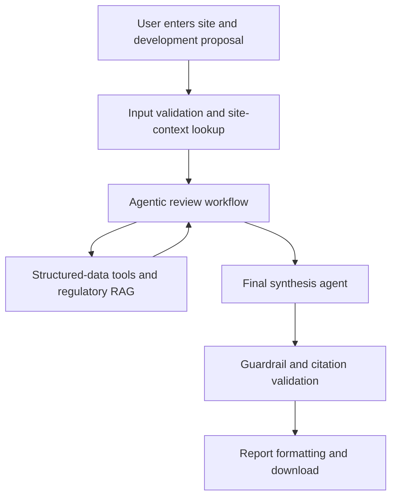

# Austin SiteFeasibility AI

Austin SiteFeasibility AI is a GenAI assistant for preliminary land-development review in Austin, Texas. Given a site address and proposed development, the system combines municipal site and historical data with source-grounded retrieval from Austin regulations. It then produces a downloadable preliminary feasibility report describing relevant requirements, potential constraints, historical context, and items requiring professional verification.

The system supports early screening only. It does not issue an official zoning determination, establish code compliance, guarantee utility service, or replace review by qualified engineers and City of Austin authorities.

## Repository Structure and Team Conventions

All team members should follow the same repository organization so that each workstream remains modular and can be integrated without moving or duplicating another member's code. For the completed Tasks 1–3, the repository should follow this structure:

```text
milestone2/
├── README.md                         # whole-project overview and workflow
├── TASKS_1-3.md                      # Tasks 1–3 implementation decisions and results
├── requirements.txt                  # shared Python dependencies
├── .gitignore
│
├── src/
│   ├── config.py                     # shared paths and model/retrieval parameters
│   ├── preprocessing/                # Task 1: data preprocessing
│   ├── rag/                          # Task 2: regulatory RAG
│   └── tools/                        # Task 3: structured-data tools
│
├── tests/                            # Tasks 1–3: correctness and regression tests
├── evaluation/                       # development performance evaluation
│   ├── retrieval/                    # Task 2: RAG retrieval benchmarks
│   └── tools/                        # Task 3: structured-tool performance
│
├── reports/                          # generated quality, benchmark, and latency results
│
└── data/
    ├── README.md                     # source links and regeneration instructions
    ├── raw/                          # original source files; never modified
    ├── processed/                    # Task 1 generated Parquet/GeoParquet files
    └── index/                        # Task 2 generated Chroma/BM25 indexes
```

The repository should follow four conventions throughout development. Application code belongs under the appropriate `src/` workstream rather than in the repository root. `tests/` answers whether the code behaves correctly, while `evaluation/` measures how well a component or the complete AI system performs; generated metrics and human-readable results belong in `reports/`. Original files in `data/raw/` must remain unchanged, and all derived data or indexes must be reproducible from those files. As Tasks 4–9 begin, new workstream directories should be added using the same pattern rather than reorganizing the existing Tasks 1–3 modules.

## How the System Works

The system uses two complementary forms of data.

- **Regulatory data** consists of the Austin Land Development Code, Drainage Criteria Manual, and Transportation Criteria Manual. These documents are chunked, embedded, and stored in a vector database for Retrieval-Augmented Generation (RAG).
- **Structured data** consists of zoning records, permits, site-plan cases, plan-review cases, floodplain polygons, and watershed boundaries. These datasets are queried with deterministic Python, Pandas, GeoPandas, and spatial-search functions.

RAG retrieves and explains regulatory language. Structured-data tools retrieve exact site facts and historical records. The agents call both types of tools and combine their outputs. RAG is therefore not a separate step that runs only once before the agents. It is a capability called by the specialized agents whenever regulatory evidence is required.



### 1. User Input

The Streamlit interface collects the following information:

- Austin street address
- proposed land use
- development description
- approximate number of units
- approximate site area
- optional latitude and longitude

### 2. Input Validation and Site Context

The system verifies that the request is within the supported Austin preliminary-review scope. It normalizes and geocodes the address, with manual coordinates available as a fallback. Structured-data tools then retrieve:

- preliminary reported zoning
- base zoning category
- floodplain intersection
- watershed
- nearby issued building permits
- site-plan cases
- plan-review cases

These outputs are factual inputs to the agentic workflow. Missing or ambiguous matches are explicitly recorded and are not replaced with model-generated assumptions.

### 3. Agentic Review Workflow

The workflow is implemented as a LangGraph state graph. A shared state carries the proposal, site context, retrieved evidence, citations, findings, warnings, and missing information between nodes.

The workflow contains the following review nodes:

1. **Input and site-validation node** validates scope, required fields, address matching, and coordinates.
2. **Site-context node** calls the zoning, floodplain, watershed, permit, site-plan, and plan-review tools.
3. **Zoning and site-plan node** uses the reported zoning and proposal to retrieve relevant provisions from Land Development Code Chapters 25-1, 25-2, and 25-5.
4. **Drainage and environmental node** uses floodplain and watershed results to retrieve relevant provisions from Land Development Code Chapters 25-7 and 25-8, Drainage Criteria Manual Sections 1, 2, and 8, and Appendix E.
5. **Transportation and access node** uses the proposal and available site context to retrieve relevant provisions from Land Development Code Chapter 25-6 and Transportation Criteria Manual Sections 1, 7, 9, and 10.
6. **Water and wastewater node** retrieves general requirements from Land Development Code Chapter 25-9 while clearly distinguishing regulatory requirements from unknown service availability or capacity.
7. **Historical-context node** interprets nearby permits, site-plan cases, and plan-review cases without treating them as approval precedent.
8. **Final synthesis node** combines the structured outputs of all review nodes into a coherent preliminary feasibility assessment.

The specialized nodes may call the regulatory retriever multiple times using queries tailored to the proposed use and retrieved site conditions. Every retrieved passage retains its source name, chapter or manual section, legal section number, title, and source URL.

### 4. Guardrail and Citation Validation

Guardrails operate before, during, and after agent execution. The implemented controls should:

- restrict the system to preliminary reviews for sites in Austin
- accept regulatory claims only from an approved source list
- require a supporting citation for every regulatory conclusion
- verify that each citation supports the associated claim
- treat retrieved documents and dataset content as evidence, not agent instructions
- return `insufficient information` when evidence is unavailable
- label zoning Open Data results as preliminary and require official verification
- prevent nearby permits and historical cases from being described as proof of future approval
- prevent definitive statements of feasibility, compliance, approval, or utility availability
- distinguish factual evidence, model inference, and required professional verification
- exclude unnecessary personal contact information from generated outputs
- classify findings as `potential constraint`, `verification required`, `insufficient information`, or `no major issue identified from available data`

If a generated claim fails citation or policy validation, the system must remove it, revise it, or label it as requiring verification before presenting the report.

### 5. Final Synthesis and Report Export

The final synthesis node is part of the agentic workflow. It uses an LLM to organize the validated outputs into a structured report containing:

- project and site description
- sources consulted
- zoning and land-use context
- site-plan considerations
- drainage, flood, and environmental considerations
- transportation and access considerations
- general water and wastewater considerations
- historical permit and case context
- potential constraints
- missing information and required verification
- source citations
- preliminary-review disclaimer

After validation, ordinary Python code places the structured report content into a consistent template and exports a downloadable DOCX, HTML, or PDF. The LLM generates the report content; the report formatter handles layout and file creation.

## Evaluation Plan

Evaluation should use 15–20 benchmark regulatory questions and at least three representative Austin site scenarios, including a normal site, a site with an identifiable constraint, and a case with missing or ambiguous information.

The evaluation should cover:

- **Retrieval Hit@5:** whether the expected regulatory source appears in the five highest-ranked chunks
- **Retrieval relevance:** whether retrieved passages directly address the question
- **Citation correctness:** whether each citation supports the claim attached to it
- **Groundedness:** the proportion of factual and regulatory claims supported by retrieved evidence
- **Unsupported-claim rate:** the proportion of factual claims lacking adequate support
- **Structured-data accuracy:** correctness of address matching, zoning lookup, floodplain intersection, watershed identification, and nearby-record retrieval
- **Agent task completion:** whether every applicable review category is completed and returned in the required schema
- **Report completeness and consistency:** whether required report sections are present and findings do not conflict across sections
- **Guardrail compliance:** performance on out-of-scope locations, missing data, ambiguous addresses, prompt-injection attempts, unsupported approval requests, and requests for definitive compliance conclusions
- **End-to-end response time:** time required to complete the site review and generate the report

Automated evaluation should be supplemented with manual verification of selected regulatory answers, structured-data matches, citations, and final reports. Only observed metrics should be reported in the presentation.

## Task Breakdown and Ownership

| No. | Workstream | Required Output | Primary Owner | Supporting Member(s) |
| ---: | --- | --- | --- | --- |
| 1 | Domain research, data collection, and preprocessing | Organized regulatory and structured data, cleaned fields, source manifest, and data-quality summary | `[Team Member Name]` | `[Team Member Name(s)]` |
| 2 | Regulatory RAG development | DOCX loader, section-aware chunking, embeddings, vector database, metadata-preserving retriever, and retrieval tests | `[Team Member Name]` | `[Team Member Name(s)]` |
| 3 | Structured-data tool development | Address normalization, zoning lookup, geocoding, floodplain and watershed intersections, nearby-permit search, and case-history search | `[Team Member Name]` | `[Team Member Name(s)]` |
| 4 | Agentic workflow and synthesis | LangGraph state, specialized review nodes, tool routing, shared outputs, and final synthesis node | `[Team Member Name]` | `[Team Member Name(s)]` |
| 5 | Guardrails and citation validation | Scope validation, source whitelist, citation checker, unsupported-claim controls, privacy filtering, and failure handling | `[Team Member Name]` | `[Team Member Name(s)]` |
| 6 | Report formatting and export | Report schema, document template, citation formatting, disclaimer, and downloadable DOCX, HTML, or PDF | `[Team Member Name]` | `[Team Member Name(s)]` |
| 7 | Evaluation and testing | Benchmark questions, site scenarios, automated metrics, manual validation, guardrail tests, and evaluation results | `[Team Member Name]` | `[Team Member Name(s)]` |
| 8 | Streamlit frontend and integration | Input form, progress display, findings and citations, error states, complete backend integration, and report download | `[Team Member Name]` | `[Team Member Name(s)]` |
| 9 | Demo, presentation, and submission | Modular codebase, README, dependency file, four required slides, recorded presentation, demo script, and final submission package | `[Team Member Name]` | `All team members` |

## Minimum Definition of Success

The minimum successful implementation must accept an Austin site and proposed development, retrieve relevant site facts from structured municipal data, retrieve applicable Austin requirements through RAG, coordinate the review through an agentic workflow, enforce guardrails, and produce a cautious source-cited downloadable report. The demo must also show measured evaluation results and at least one guardrail response.
