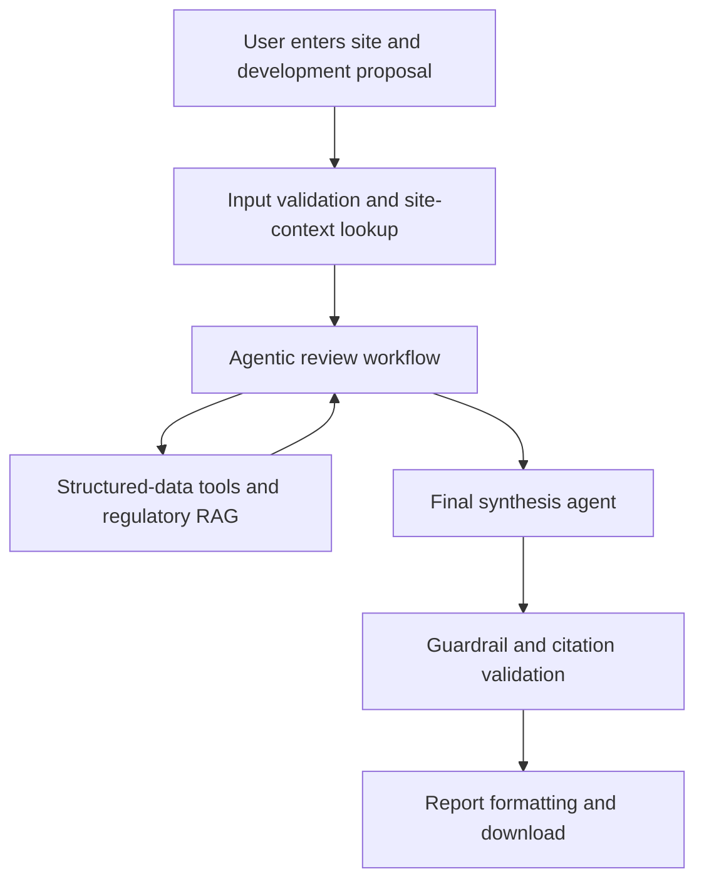

# Austin SiteFeasibility AI

Austin SiteFeasibility AI is a GenAI assistant for preliminary land-development review in Austin, Texas. Given a site address and proposed development, the system combines municipal site and historical data with source-grounded retrieval from Austin regulations. It then produces a downloadable preliminary feasibility report describing relevant requirements, potential constraints, historical context, and items requiring professional verification.

The system supports early screening only. It does not issue an official zoning determination, establish code compliance, guarantee utility service, or replace review by qualified engineers and City of Austin authorities.

## Repository Structure

The repository is organized by responsibility. Application code lives under `src/`, with separate packages for preprocessing, RAG, structured-data tools, agent orchestration, guardrails, and report generation. The Streamlit entry point is under `app/`. Correctness and integration checks are under `tests/`, while measured benchmarks, adversarial scenarios, evaluation scripts, and generated scorecards are under `evaluation/`.

Source files that are too large for Git are excluded from `data/raw/`. Their acquisition and regeneration instructions are documented in `data/README.md`. The cleaned Parquet/GeoParquet files under `data/processed/` and the Chroma index under `data/index/` are committed for reproducible demonstration. Detailed implementation notes are split across the task documents at the repository root.

Shared paths and configuration belong in `src/config.py`. Commands should be run from the repository root using module syntax, such as `python -m src.preprocessing.run_all`. New correctness tests belong in `tests/`; evaluation logic and generated evaluation evidence belong in the corresponding area under `evaluation/`.

```
├── README.md          # this file: project overview, architecture, workflow
├── TASKS_1-3.md       # Tasks 1–3: implementation details, decisions, measured results
├── TASKS_5-6.md       # Tasks 5–6: guardrails, citation validation, report export
├── TASKS_8.md         # Task 8: Streamlit frontend
├── requirements.txt   # shared Python dependencies (add yours here, one file for all)
│
├── src/                          # all implementation code
│   ├── config.py                 # shared paths & parameters — import this, never hardcode paths
│   │
│   │  # ── implemented ──
│   ├── preprocessing/            # Task 1: raw data -> cleaned Parquet + manifest + QA report
│   ├── rag/                      # Task 2: DOCX -> chunks -> vector index -> hybrid retriever
│   ├── tools/                    # Task 3: zoning / geocode / floodplain / watershed / nearby
│   ├── agents/                   # Task 4: LangGraph state, review nodes, tool routing, synthesis
│   ├── guardrails/               # Task 5: scope validation, source whitelist, citation checker,
│   │                             #   unsupported-claim controls, privacy filtering
│   └── report/                   # Task 6: report schema, template, citation formatting,
│                                 #   DOCX/HTML/PDF export
│
├── app/                          # Task 8: Streamlit frontend — input form, progress,
│                                 #   findings + citations display, report download
│
├── tests/                        # pytest correctness tests, one file per workstream
│   ├── test_preprocessing.py     #   Task 1 (implemented)
│   ├── test_rag.py               #   Task 2 (implemented)
│   ├── test_tools.py             #   Task 3 (implemented)
│   ├── test_agents.py            #   Task 4 (implemented)
│   ├── test_guardrails.py        #   Task 5 (implemented)
│   ├── test_report.py            #   Task 6 (implemented)
│   ├── test_evaluation.py        #   Task 7 harness tests (implemented, offline)
│   ├── test_app.py               #   Task 8 (implemented)
│
├── evaluation/                   # benchmarks & measured metrics (Task 7)
│   ├── run_all.py                #   runs every stage -> results/EVALUATION.md scorecard
│   ├── benchmarks/               #   held-out questions, site scenarios, adversarial cases
│   ├── judge/                    #   local LLM judge + code-side verdict enforcement
│   ├── scenarios/                #   graph runs, cached states, end-to-end timing
│   ├── retrieval/                #   Task 2 sanity benchmark + Task 7 held-out set
│   ├── tools/                    #   Task 3 latency + structured-data accuracy
│   ├── grounding/                #   groundedness, unsupported claims, citation support
│   ├── guardrails/               #   six-category adversarial compliance
│   ├── report/                   #   completeness, export integrity, consistency
│   ├── manual/                   #   hand-scored sample + judge-agreement rate
│   └── results/                  #   EVALUATION.md + evaluation_results.json
│
├── docs/                         # Task 9 (planned): presentation slides, video demo & presentation link
│
└── data/
    ├── raw/                      #   original DOCX/CSV/GeoJSON — NOT in git (over GitHub size
    │                             #   limits); download link in data/README.md (only needed to
    │                             #   re-run preprocessing or rebuild the index)
    ├── processed/                #   cleaned datasets (committed, ready to use)
    └── index/                    #   vector index (committed, ready to use)
```


## How the System Works

The system uses two complementary forms of data.

- **Regulatory data** consists of the Austin Land Development Code, Drainage Criteria Manual, and Transportation Criteria Manual. These documents are chunked, embedded, and stored in a vector database for Retrieval-Augmented Generation (RAG).
- **Structured data** consists of zoning records, permits, site-plan cases, plan-review cases, floodplain polygons, and watershed boundaries. These datasets are queried with deterministic Python, Pandas, GeoPandas, and spatial-search functions.

RAG retrieves and explains regulatory language. Structured-data tools retrieve exact site facts and historical records. The agents call both types of tools and combine their outputs. RAG is therefore not a separate step that runs only once before the agents. It is a capability called by the specialized agents whenever regulatory evidence is required.



### 1. User Input

The Streamlit interface collects the following information:

- Austin street address
- proposed land use
- development description
- approximate number of units
- approximate site area
- optional latitude and longitude

### 2. Input Validation and Site Context

The system verifies that the request is within the supported Austin preliminary-review scope. It normalizes and geocodes the address, with manual coordinates available as a fallback. Structured-data tools then retrieve:

- preliminary reported zoning
- base zoning category
- floodplain intersection
- watershed
- nearby issued building permits
- site-plan cases
- plan-review cases

These outputs are factual inputs to the agentic workflow. Missing or ambiguous matches are explicitly recorded and are not replaced with model-generated assumptions.

### 3. Agentic Review Workflow

The workflow is implemented as a LangGraph state graph. A shared state carries the proposal, site context, retrieved evidence, citations, findings, warnings, and missing information between nodes.

The workflow contains the following review nodes:

1. **Input and site-validation node** validates scope, required fields, address matching, and coordinates.
2. **Site-context node** calls the zoning, floodplain, watershed, permit, site-plan, and plan-review tools.
3. **Zoning and site-plan node** uses the reported zoning and proposal to retrieve relevant provisions from Land Development Code Chapters 25-1, 25-2, and 25-5.
4. **Drainage and environmental node** uses floodplain and watershed results to retrieve relevant provisions from Land Development Code Chapters 25-7 and 25-8, Drainage Criteria Manual Sections 1, 2, and 8, and Appendix E.
5. **Transportation and access node** uses the proposal and available site context to retrieve relevant provisions from Land Development Code Chapter 25-6 and Transportation Criteria Manual Sections 1, 7, 9, and 10.
6. **Water and wastewater node** retrieves general requirements from Land Development Code Chapter 25-9 while clearly distinguishing regulatory requirements from unknown service availability or capacity.
7. **Historical-context node** interprets nearby permits, site-plan cases, and plan-review cases without treating them as approval precedent.
8. **Final synthesis node** combines the structured outputs of all review nodes into a coherent preliminary feasibility assessment.

The specialized nodes may call the regulatory retriever multiple times using queries tailored to the proposed use and retrieved site conditions. Every retrieved passage retains its source name, chapter or manual section, legal section number, title, and source URL.

### 4. Guardrail and Citation Validation

Guardrails operate before, during, and after agent execution. The implemented controls should:

- restrict the system to preliminary reviews for sites in Austin
- accept regulatory claims only from an approved source list
- require a supporting citation for every regulatory conclusion
- verify that each citation supports the associated claim
- treat retrieved documents and dataset content as evidence, not agent instructions
- return `insufficient information` when evidence is unavailable
- label zoning Open Data results as preliminary and require official verification
- prevent nearby permits and historical cases from being described as proof of future approval
- prevent definitive statements of feasibility, compliance, approval, or utility availability
- distinguish factual evidence, model inference, and required professional verification
- exclude unnecessary personal contact information from generated outputs
- classify findings as `potential constraint`, `verification required`, `insufficient information`, or `no major issue identified from available data`

If a generated claim fails citation or policy validation, the system must remove it, revise it, or label it as requiring verification before presenting the report.

### 5. Final Synthesis and Report Export

The final synthesis node is part of the agentic workflow. It uses an LLM to organize the validated outputs into a structured report containing:

- project and site description
- sources consulted
- zoning and land-use context
- site-plan considerations
- drainage, flood, and environmental considerations
- transportation and access considerations
- general water and wastewater considerations
- historical permit and case context
- potential constraints
- missing information and required verification
- source citations
- preliminary-review disclaimer

After validation, ordinary Python code places the structured report content into a consistent template and exports a downloadable DOCX, HTML, or PDF. The LLM generates the report content; the report formatter handles layout and file creation.

## Evaluation Plan

Evaluation should use 15–20 benchmark regulatory questions and at least three representative Austin site scenarios, including a normal site, a site with an identifiable constraint, and a case with missing or ambiguous information.

The evaluation should cover:

- **Retrieval Hit@5:** whether the expected regulatory source appears in the five highest-ranked chunks
- **Retrieval relevance:** whether retrieved passages directly address the question
- **Citation correctness:** whether each citation supports the claim attached to it
- **Groundedness:** the proportion of factual and regulatory claims supported by retrieved evidence
- **Unsupported-claim rate:** the proportion of factual claims lacking adequate support
- **Structured-data accuracy:** correctness of address matching, zoning lookup, floodplain intersection, watershed identification, and nearby-record retrieval
- **Agent task completion:** whether every applicable review category is completed and returned in the required schema
- **Report completeness and consistency:** whether required report sections are present and findings do not conflict across sections
- **Guardrail compliance:** performance on out-of-scope locations, missing data, ambiguous addresses, prompt-injection attempts, unsupported approval requests, and requests for definitive compliance conclusions
- **End-to-end response time:** time required to complete the site review and generate the report

Automated evaluation should be supplemented with manual verification of selected regulatory answers, structured-data matches, citations, and final reports. Only observed metrics should be reported in the presentation.

## Task Breakdown and Ownership

| No. | Workstream | Required Output | Owner |
| ---: | --- | --- | --- |
| 1 | Domain research, data collection, and preprocessing | Organized regulatory and structured data, cleaned fields, source manifest, and data-quality summary | Delaram Hassanlou |
| 2 | Regulatory RAG development | DOCX loader, section-aware chunking, embeddings, vector database, metadata-preserving retriever, and retrieval tests | Delaram Hassanlou |
| 3 | Structured-data tool development | Address normalization, zoning lookup, geocoding, floodplain and watershed intersections, nearby-permit search, and case-history search | Delaram Hassanlou |
| 4 | Agentic workflow and synthesis | LangGraph state, specialized review nodes, tool routing, shared outputs, and final synthesis node | Ihina Mahajan |
| 5 | Guardrails and citation validation | Scope validation, source whitelist, citation checker, unsupported-claim controls, privacy filtering, and failure handling | Shivani Kandimalla |
| 6 | Report formatting and export | Report schema, document template, citation formatting, disclaimer, and downloadable DOCX, HTML, or PDF | Shivani Kandimalla |
| 7 | Evaluation and testing | Benchmark questions, site scenarios, automated metrics, manual validation, guardrail tests, and evaluation results | Mariem Guitouni |
| 8 | Streamlit frontend and integration | Input form, progress display, findings and citations, error states, complete backend integration, and report download | Ali Sura Ozdemir |
| 9 | Demo, presentation, and submission | Modular codebase, README, dependency file, four required slides, recorded presentation, demo script, and final submission package | All team members |


## Implemented Technology Stack

| Layer | Implemented Components | Purpose |
| --- | --- | --- |
| Data | CSV, DOCX, GeoJSON, Parquet, GeoParquet | Source documents and processed municipal data |
| Vector store | ChromaDB | Persistent regulatory embedding index |
| Retrieval | BAAI `bge-base-en-v1.5`, BM25, weighted reciprocal-rank fusion | Semantic and lexical regulatory retrieval |
| Structured tools | Pandas, GeoPandas, Shapely, PyProj, RapidFuzz, usaddress | Address, zoning, spatial, and nearby-record queries |
| Orchestration | LangGraph | Ordered review workflow and shared state |
| Generative model | Configurable OpenAI Chat Completions model | Optional final synthesis |
| Application | Python and Streamlit | User input, findings, citations, and downloads |
| Reporting | python-docx and fpdf2 | Markdown, HTML, DOCX, and PDF export |
| Evaluation | pytest plus custom retrieval, grounding, guardrail, and scenario evaluators | Correctness and measured prototype performance |


## Setup

Python 3.11 is recommended. The first run requires internet access to download the BGE embedding model unless it is already cached. The processed datasets and vector index are included, but the embedding model itself is not stored in Git.

```bash
git clone https://github.com/deleydel/Austin-Site-Feasibility-Review.git
cd Austin-Site-Feasibility-Review

python3.11 -m venv .venv
source .venv/bin/activate
python -m pip install --upgrade pip
pip install -r requirements.txt
```

On Windows PowerShell, activate the environment with:

```powershell
.venv\Scripts\Activate.ps1
```

The initial model download can be completed explicitly with:

```bash
python -c "from sentence_transformers import SentenceTransformer; SentenceTransformer('BAAI/bge-base-en-v1.5')"
```

Then run the application:

```bash
streamlit run app/streamlit_app.py
```

### Optional LLM synthesis

The workflow runs without an API key, but the final synthesis is deterministic unless LLM synthesis is enabled. To use the configured OpenAI model, set:

```bash
export OPENAI_API_KEY="your-key"
export ENABLE_LLM_SYNTHESIS="true"
export SYNTHESIS_MODEL="gpt-5.4-mini"
```

Do not commit API keys or `.env` files. On Windows PowerShell, use `$env:VARIABLE_NAME="value"`.

## Testing

Run the complete test suite from the repository root:

```bash
python -m pytest tests/ -q
```

The current suite contains 99 checks. Tests that initialize the regulatory retriever require the BGE model to be available locally; a fresh environment downloads it on first use. To test without network access, cache the model first and then set the Hugging Face offline environment variables.

Run the evaluation scorecard with:

```bash
python -m evaluation.run_all
```

Evaluation outputs are written under `evaluation/results/` and the individual evaluation workstream folders. Regenerate them whenever retrieval, prompts, agent logic, guardrails, or report generation changes.

## Minimum Definition of Success

The minimum successful implementation must accept an Austin site and proposed development, retrieve relevant site facts from structured municipal data, retrieve applicable Austin requirements through RAG, coordinate the review through an agentic workflow, enforce guardrails, and produce a cautious source-cited downloadable report. The demo must also show measured evaluation results and at least one guardrail response.
