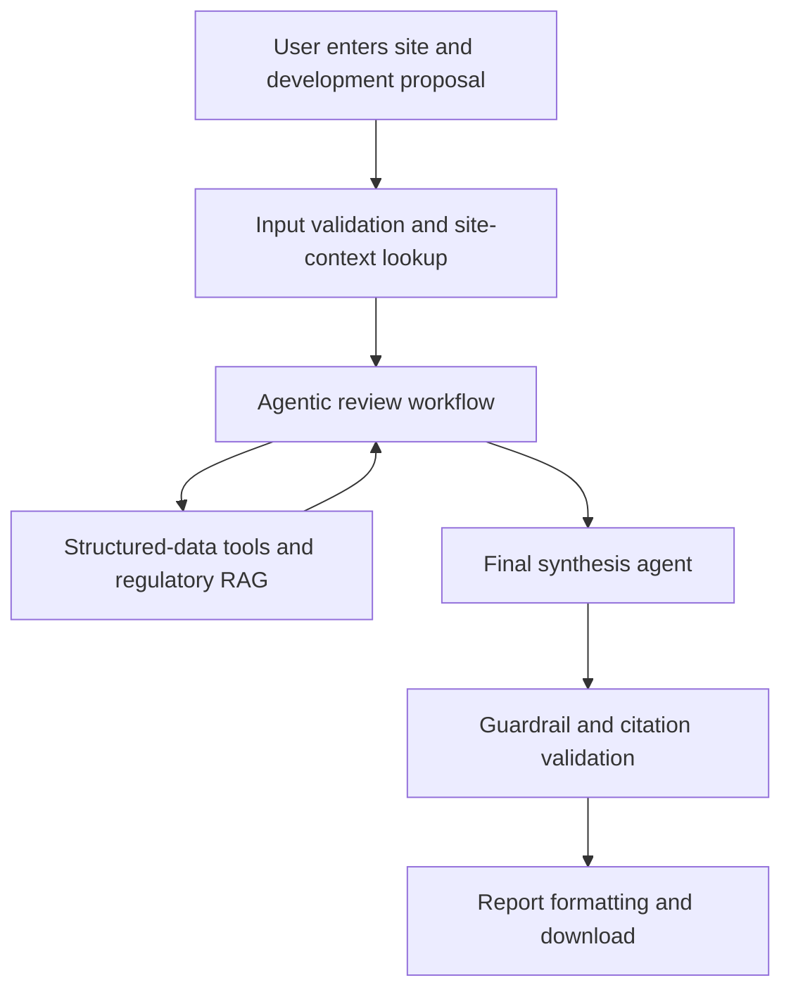

# Austin SiteFeasibility AI

Austin SiteFeasibility AI is a GenAI assistant for preliminary land-development review in Austin, Texas. Given a site address and proposed development, the system combines municipal site and historical data with source-grounded retrieval from Austin regulations. It then produces a downloadable preliminary feasibility report describing relevant requirements, potential constraints, historical context, and items requiring professional verification.

The system supports early screening only. It does not issue an official zoning determination, establish code compliance, guarantee utility service, or replace review by qualified engineers and City of Austin authorities.

## Repository Structure

The repository is organized by responsibility. Application code lives under `src/`, with separate packages for preprocessing, RAG, structured-data tools, agent orchestration, guardrails, and report generation. The Streamlit entry point is under `app/`. Correctness and integration checks are under `tests/`, while measured benchmarks, adversarial scenarios, evaluation scripts, and generated scorecards are under `evaluation/`.

Source files that are too large for Git are excluded from `data/raw/`. Their acquisition and regeneration instructions are documented in `data/README.md`. The cleaned Parquet/GeoParquet files under `data/processed/` and the Chroma index under `data/index/` are committed for reproducible demonstration. Detailed implementation notes are split across the task documents at the repository root.

Shared paths and configuration belong in `src/config.py`. Commands should be run from the repository root using module syntax, such as `python -m src.preprocessing.run_all`. New correctness tests belong in `tests/`; evaluation logic and generated evaluation evidence belong in the corresponding area under `evaluation/`.

```
├── README.md          # this file: project overview, architecture, workflow
├── TASKS_1-3.md       # Tasks 1–3: implementation details, decisions, measured results
├── TASKS_5-6.md       # Tasks 5–6: guardrails, citation validation, report export
├── TASKS_8.md         # Task 8: Streamlit frontend
├── requirements.txt   # shared Python dependencies (add yours here, one file for all)
│
├── src/                          # all implementation code
│   ├── config.py                 # shared paths & parameters — import this, never hardcode paths
│   │
│   │  # ── implemented ──
│   ├── preprocessing/            # Task 1: raw data -> cleaned Parquet + manifest + QA report
│   ├── rag/                      # Task 2: DOCX -> chunks -> vector index -> hybrid retriever
│   ├── tools/                    # Task 3: zoning / geocode / floodplain / watershed / nearby
│   ├── agents/                   # Task 4: LangGraph state, review nodes, tool routing, synthesis
│   ├── guardrails/               # Task 5: scope validation, source whitelist, citation checker,
│   │                             #   unsupported-claim controls, privacy filtering
│   └── report/                   # Task 6: report schema, template, citation formatting,
│                                 #   DOCX/HTML/PDF export
│
├── app/                          # Task 8: Streamlit frontend — input form, progress,
│                                 #   findings + citations display, report download
│
├── tests/                        # pytest correctness tests, one file per workstream
│   ├── test_preprocessing.py     #   Task 1 (implemented)
│   ├── test_rag.py               #   Task 2 (implemented)
│   ├── test_tools.py             #   Task 3 (implemented)
│   ├── test_agents.py            #   Task 4 (implemented)
│   ├── test_guardrails.py        #   Task 5 (implemented)
│   ├── test_report.py            #   Task 6 (implemented)
│   ├── test_evaluation.py        #   Task 7 harness tests (implemented, offline)
│   ├── test_app.py               #   Task 8 (implemented)
│
├── evaluation/                   # benchmarks & measured metrics (Task 7)
│   ├── run_all.py                #   runs every stage -> results/EVALUATION.md scorecard
│   ├── benchmarks/               #   held-out questions, site scenarios, adversarial cases
│   ├── judge/                    #   local LLM judge + code-side verdict enforcement
│   ├── scenarios/                #   graph runs, cached states, end-to-end timing
│   ├── retrieval/                #   Task 2 sanity benchmark + Task 7 held-out set
│   ├── tools/                    #   Task 3 latency + structured-data accuracy
│   ├── grounding/                #   groundedness, unsupported claims, citation support
│   ├── guardrails/               #   six-category adversarial compliance
│   ├── report/                   #   completeness, export integrity, consistency
│   ├── manual/                   #   hand-scored sample + judge-agreement rate
│   └── results/                  #   EVALUATION.md + evaluation_results.json
│
│   
│
└── data/
    ├── raw/                      #   original DOCX/CSV/GeoJSON — NOT in git (over GitHub size
    │                             #   limits); download link in data/README.md (only needed to
    │                             #   re-run preprocessing or rebuild the index)
    ├── processed/                #   cleaned datasets (committed, ready to use)
    └── index/                    #   vector index (committed, ready to use)
```


## How the System Works

The system uses two complementary forms of data.

- **Regulatory data** consists of the Austin Land Development Code, Drainage Criteria Manual, and Transportation Criteria Manual. These documents are chunked, embedded, and stored in a vector database for Retrieval-Augmented Generation (RAG).
- **Structured data** consists of zoning records, permits, site-plan cases, plan-review cases, floodplain polygons, and watershed boundaries. These datasets are queried with deterministic Python, Pandas, GeoPandas, and spatial-search functions.

RAG is a capability used inside the review workflow rather than a separate one-time step. Each specialized review node can retrieve regulatory evidence relevant to its topic. Structured-data functions provide site-specific facts, while the retriever provides applicable regulatory passages.



The implemented review sequence is:

1. Validate required input and preliminary geographic scope.
2. Normalize and geocode the address, or use supplied coordinates when available.
3. Retrieve zoning, floodplain, watershed, nearby permits, site-plan cases, and plan-review cases.
4. Run specialized zoning/site-plan, drainage/environmental, transportation/access, water/wastewater, and historical-context review nodes.
5. Retrieve regulatory passages with hybrid dense and BM25 search while preserving source metadata.
6. Assemble a synthesis. LLM synthesis is optional and disabled unless explicitly configured.
7. Apply scope, source, citation, unsupported-claim, and privacy checks.
8. Display the result in Streamlit and export Markdown, HTML, DOCX, or PDF reports.


## Framework at a Glance

| Part | Where | What it does |
| --- | --- | --- |
| Data preprocessing (Task 1) | `src/preprocessing/` | Cleans municipal CSV/GeoJSON into Parquet, drops PII, writes the source manifest and data-quality report |
| Regulatory RAG (Task 2) | `src/rag/` | Parses the LDC/DCM/TCM DOCX into section-aware chunks, embeds them (BGE + ChromaDB), and serves hybrid dense+BM25 retrieval with lay-language query expansion and exact section lookup |
| Structured-data tools (Task 3) | `src/tools/` | Deterministic zoning, geocoding, floodplain, watershed, and nearby-record lookups with explicit safety statuses |
| Agentic workflow (Task 4) | `src/agents/` | LangGraph review graph: input validation, site context, specialized review nodes, deterministic zoning-conflict check, optional LLM synthesis |
| Guardrails (Task 5) | `src/guardrails/` | Scope validation, approved-source and citation verification, unsupported-claim sanitization, privacy filtering |
| Report generation (Task 6) | `src/report/` | Structured report schema, template, and Markdown/HTML/DOCX/PDF export |
| Evaluation (Task 7) | `evaluation/` | Retrieval, grounding, guardrail, scenario, and report benchmarks with a local LLM judge; results in `evaluation/results/` |
| Frontend (Task 8) | `app/` | Streamlit form, progress display, findings, citations, and report downloads |

## Results Summary

Current measured results (full scorecard with sample sizes and caveats:
[`evaluation/results/EVALUATION.md`](evaluation/results/EVALUATION.md)):

| Area | Result |
| --- | --- |
| Retrieval (held-out, 22 q) | Hit@5 0.955, MRR 0.924; lay-language phrasing Hit@5 0.895 |
| Structured-data tools | 100 % accuracy (n=264); 100 % safe failure on unanswerable cases (n=32) |
| Agent workflow | 10/10 scenarios complete; deterministic SF-3/multifamily conflict surfaced in the final report |
| Guardrails | 100 % compliance across all six adversarial categories (n=20) |
| Reports | 100 % completeness and consistency; all four export formats |
| LLM synthesis quality | groundedness of local-model synthesis remains the weak point (22–45 % across runs) and varies with the model used |
| Tool latency | 0.2–80 ms per call (slowest: nearby plan-review search) |

LLM-dependent metrics (groundedness, guardrail categories that inspect
generated text) vary between runs of the local judge/synthesis model; treat
single-run values as indicative, not exact.

## Implemented Technology Stack

| Layer | Implemented Components | Purpose |
| --- | --- | --- |
| Data | CSV, DOCX, GeoJSON, Parquet, GeoParquet | Source documents and processed municipal data |
| Vector store | ChromaDB | Persistent regulatory embedding index |
| Retrieval | BAAI `bge-base-en-v1.5`, BM25, weighted reciprocal-rank fusion | Semantic and lexical regulatory retrieval |
| Structured tools | Pandas, GeoPandas, Shapely, PyProj, RapidFuzz, usaddress | Address, zoning, spatial, and nearby-record queries |
| Orchestration | LangGraph | Ordered review workflow and shared state |
| Generative model | Configurable OpenAI Chat Completions model | Optional final synthesis |
| Application | Python and Streamlit | User input, findings, citations, and downloads |
| Reporting | python-docx and fpdf2 | Markdown, HTML, DOCX, and PDF export |
| Evaluation | pytest plus custom retrieval, grounding, guardrail, and scenario evaluators | Correctness and measured prototype performance |


## Setup

Python 3.11 is recommended. The first run requires internet access to download the BGE embedding model unless it is already cached. The processed datasets and vector index are included, but the embedding model itself is not stored in Git.

```bash
git clone https://github.com/deleydel/Austin-Site-Feasibility-Review.git
cd Austin-Site-Feasibility-Review

python3.11 -m venv .venv
source .venv/bin/activate
python -m pip install --upgrade pip
pip install -r requirements.txt
```

On Windows PowerShell, activate the environment with:

```powershell
.venv\Scripts\Activate.ps1
```

The initial model download can be completed explicitly with:

```bash
python -c "from sentence_transformers import SentenceTransformer; SentenceTransformer('BAAI/bge-base-en-v1.5')"
```

Then run the application:

```bash
streamlit run app/streamlit_app.py
```

### Optional LLM synthesis

The workflow runs without an API key, but the final synthesis is deterministic unless LLM synthesis is enabled. To use the configured OpenAI model, set:

```bash
export OPENAI_API_KEY="your-key"
export ENABLE_LLM_SYNTHESIS="true"
export SYNTHESIS_MODEL="gpt-5.4-mini"
```

Do not commit API keys or `.env` files. On Windows PowerShell, use `$env:VARIABLE_NAME="value"`.

## Testing

Run the complete test suite from the repository root:

```bash
python -m pytest tests/ -q
```

The repository includes more than 100 correctness and integration checks (109 at the time of writing; use the pytest output as the authoritative count). Tests that initialize the regulatory retriever require the BGE model to be available locally; a fresh environment downloads it on first use. To test without network access, cache the model first and then set the Hugging Face offline environment variables.

Run the evaluation scorecard with:

```bash
python -m evaluation.run_all
```

Evaluation outputs are written under `evaluation/results/` and the individual evaluation workstream folders. Regenerate them whenever retrieval, prompts, agent logic, guardrails, or report generation changes.

## Task Breakdown and Ownership

| No. | Workstream | Required Output | Owner |
| ---: | --- | --- | --- |
| 1 | Domain research, data collection, and preprocessing | Organized regulatory and structured data, cleaned fields, source manifest, and data-quality summary | Delaram Hassanlou |
| 2 | Regulatory RAG development | DOCX loader, section-aware chunking, embeddings, vector database, metadata-preserving retriever, and retrieval tests | Delaram Hassanlou |
| 3 | Structured-data tool development | Address normalization, zoning lookup, geocoding, floodplain and watershed intersections, nearby-permit search, and case-history search | Delaram Hassanlou |
| 4 | Agentic workflow and synthesis | LangGraph state, specialized review nodes, tool routing, shared outputs, and final synthesis node | Ihina Mahajan |
| 5 | Guardrails and citation validation | Scope validation, source whitelist, citation checker, unsupported-claim controls, privacy filtering, and failure handling | Shivani Kandimalla |
| 6 | Report formatting and export | Report schema, document template, citation formatting, disclaimer, and downloadable DOCX, HTML, or PDF | Shivani Kandimalla |
| 7 | Evaluation and testing | Benchmark questions, site scenarios, automated metrics, manual validation, guardrail tests, and evaluation results | Mariem Guitouni |
| 8 | Streamlit frontend and integration | Input form, progress display, findings and citations, error states, complete backend integration, and report download | Ali Sura Ozdemir |
| 9 | Demo, presentation, and submission | Modular codebase, README, dependency file, four required slides, recorded presentation, demo script, and final submission package | All team members |


## Minimum Definition of Success

The minimum successful implementation must accept an Austin site and proposed development, retrieve relevant site facts from structured municipal data, retrieve applicable Austin requirements through RAG, coordinate the review through an agentic workflow, enforce guardrails, and produce a cautious source-cited downloadable report. The demo must also show measured evaluation results and at least one guardrail response.
